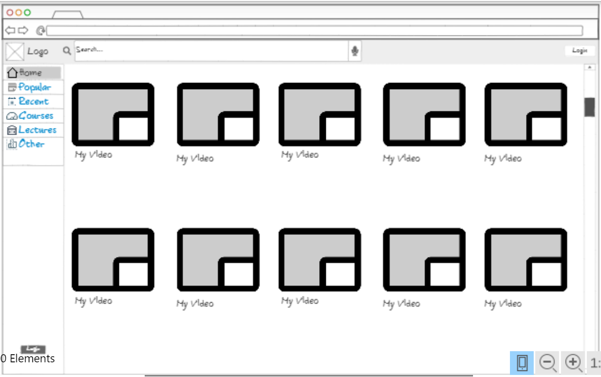
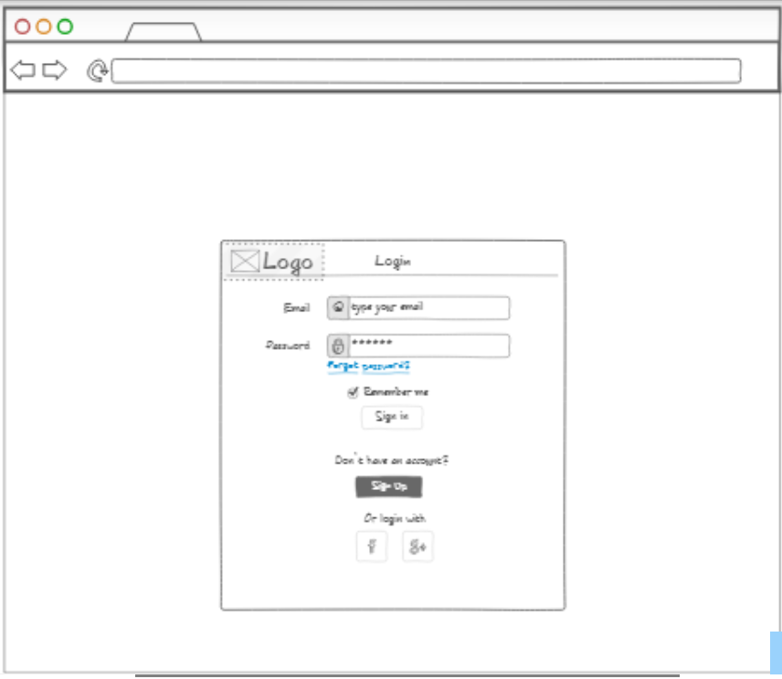
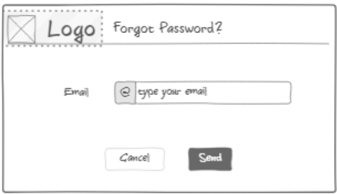
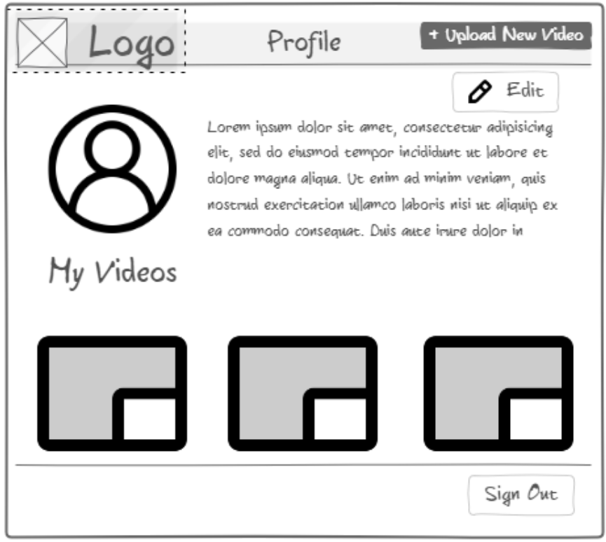
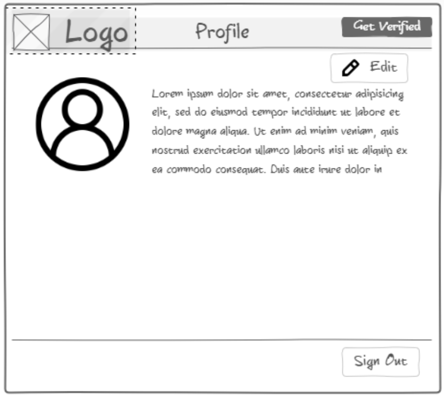
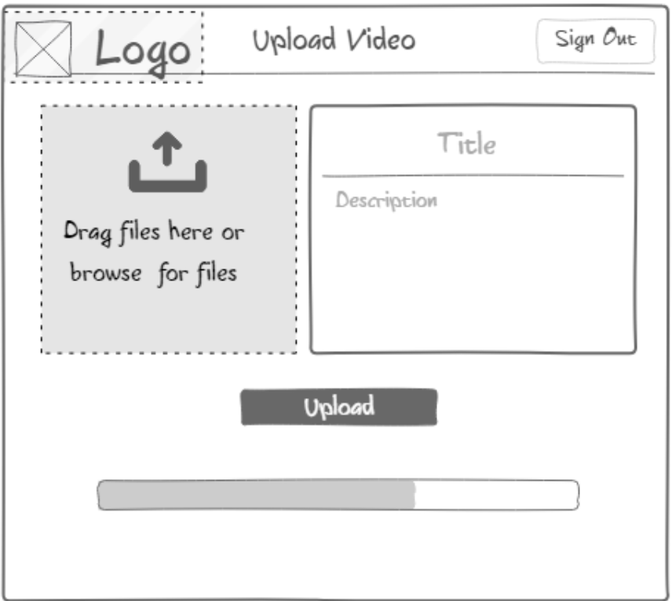

# Startup
--------------------

## Startup Specification

### Elevator Pitch

This is a video library where verified users can upload instructional or informational videos. Users will be able to access the site without an account or by obtaining an unverified account, but will only be able to submit videos publicly by obtaining a verified account.

### Key Features

- "Like"
- Comments by signed-in users
- Comment removal by video submitter
- Flag inappropriate videos
- Google image search for thumbnails when uploading videos

### Using Technologies

1. **Authentication:** Users will be able to create an account and log in. They will also be able to verify their account in order to submit videos to the site. With an unverified account, users will be able to comment on and "Like" videos.
2. **Database Data:** Videos, comments, likes, and flags, as well as the associated user data will have to be stored in and retrieved from a database.
3. **Websocket Data:** Whenever another user posts a video, makes a comment, likes a video, or flags a video, everything will need to be updated in real time.

### Site Map

---------------------------

## HTML Deliverable

For this deliverable I built out the structure of my application using HTML.

- **HTML pages** - Quite a few different pages with different functions. Located in the HTML_files folder.
- **Links** - Each page links together, except for the seperation between "verified" users, due to the outside interaction required.
- **Text** - There isn't really much text (some though,) but I think that's not really where the bulk of my project will be.
- **Images** - I have an image for my logo present on each page.
- **DB/Login** - Input box and submit button for login. Database will be the video library along with other information.
- **WebSocket** - Video posts will be represented as real-time interactions. If I have time, I may also include a comments feature or a "like" feature.
